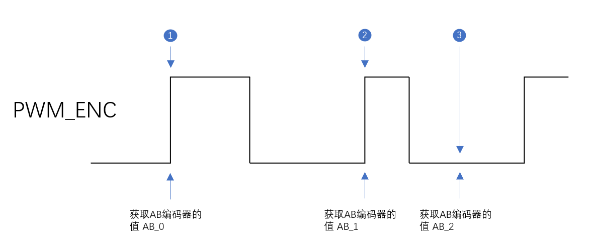

<!--  TOC -->

# 1 引言

## 1.1 编写目的

本说明文档目的在于明确说明欢乐送下位机固件使用 `GD32f450VG` 芯片移植的注意事项

## 1.2 背景

`STM32F722ZE` 芯片短缺，使用 `GD32f450` 替代

# 2 总体设计

## 2.1 概述

在原有 `STM32F722` 固件基础上进行固件优化，以及增加放错刷固件机制。

## 2.2 修改内容

### 2.2.1 M电机优化

M电机采用定时器捕获绝对位置编码器的周期和占空比，在AB编码器旋转一周后矫正位置。如下图

* 获取此时AB编码器的值记为AB_0
* 获取此时AB编码器的值记为AB_1,并获取 1 位置的占空比和周期。
* 在矫正的3位置在获取当前AB编码器的值AB_2,此时计算出来的位置为1的位置，所以需要补偿1-3段位置
* 补偿公式为 `Pnow = P1 + ▲P(1-3) ;  ▲P(1-3) ≈ P(AB_2) - P(AB_0)`;

### 2.2.2 OTA 校验MCU标识符

在bootloader中程序：
`unsigned char mcu_type[10] __attribute__( ( at( FIRMWARE_BASE_ADDRESS + FIRMWARE_SIGNATURE_OFFSET + 0x0C + sizeof(FirmwareInfo) ) ) );`

在APP中程序定义
`const unsigned char mcu_type[10] __attribute__( ( at( FIRMWARE_BASE_ADDRESS + FIRMWARE_SIGNATURE_OFFSET + 0x0C + sizeof(FirmwareInfo) ) ) ) = "gd32f45x";`

在bootloader跳转前判断是否与`gd32f45x`一致。

## 2.3 系统环境

### 2.3.1 开发环境

| 项目       | 规格说明            |
| ---------- | ------------------- |
| 嵌入式系统 | 无           |
| 开发语言   | C语言               |
| 开发工具链 | MDK-ARM             |
| IDE        | Keil5                |
| 开发系统   | window 7、window 10 |

### 2.3.2 固件运行环境

| 项目           | 规格说明     |
| -------------- | ------------ |
| 嵌入式实时系统 | 无   |
| MCU平台        | GD32F450VG    |
| 第三方库       | GD标准外设库 |

### 2.3.3 固件使用环境

机器人本体`Hls-4.13.0.1-general-2021-10-29-hls-release-signed.apk` 及以上版本

# 3 GD32F450移植注意事项

`gd32f450` 库函数与`STM32F722`中有些不同，其中库函数中有一些名字类似但是形参和功能不同，需要注意：
* 在`system_gd32f4xx.c` 中根据有无晶振，晶振频率选择系统时钟，目前使用8M外部晶振，故选用 `__SYSTEM_CLOCK_200M_PLL_8M_HXTAL`； 
* GD工程库头文件包含在`gd32f4xx_libopt.h`中；
* `gd32f4xx.h`中`#if ! define (GD32F450)....`下面取消`GD32F450`的注释；
* 初始化时调用`StstemInit()`;用于配置时钟，调用`systick_config()`;打开滴答定时器； 注意`systick_config `与 `Systick_Config(xxxx)`是**不同的，注意大小写**；
* 中断优先级分组函数注意`NVIC_SetPriorityGrouping`和`nvic_priority_group_set`区别，要使用`nvic_priority_group_set(NVIC_PRIGROUP_PRE4_SUB0);`这个函数。

# 4 模块维护及构建要求

暂无

